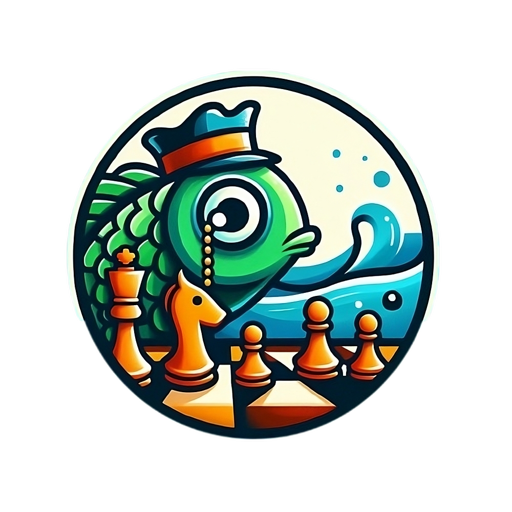

# Repositorio grupal - Ingeniería de Software I - 2024-2

## 📚SuperChess64 📊 

  

***Lenguajes de programación*** 🖥️

 <a href="https://developer.mozilla.org/en-US/docs/Web/JavaScript" target="_blank" rel="noreferrer"></ 

***Frameworks y entornos de ejecución*** 🧠

  

***Herramientas y bases de datos*** 💡

  

## Objetivo del proyecto 🚀
El objetivo de este proyecto es desarrollar una plataforma web interactiva que permita a los usuarios jugar al ajedrez en línea, ya sea en partidas en tiempo real contra otros jugadores o enfrentándose a un motor de inteligencia artificial (StockFish) con distintos niveles de dificultad.

## Autores 🤝
- [**Julian Esteban Cadena Rojas**](https://www.github.com/jcadenar)
- [**Roger Fabián Bonilla Caro**](https://github.com/RoierOc)
- [**Mateo Becerra Porras**](https://github.com/mabecerrap)
- [**Jacel Thomás Enciso Pinzón**](https://github.com/slendrac123)
